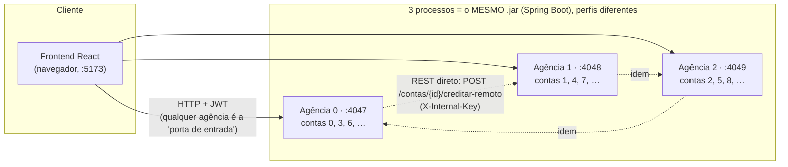
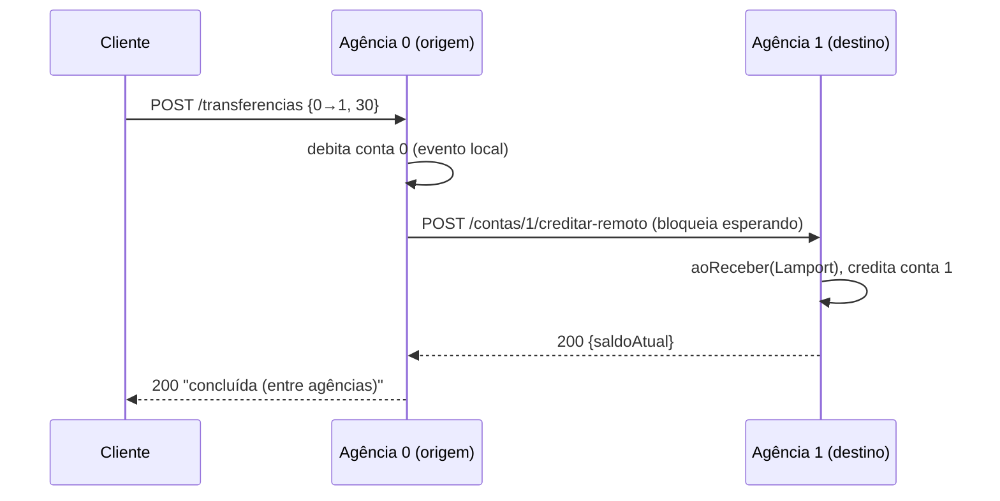
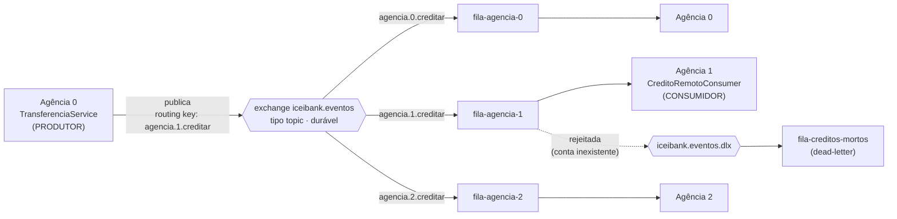
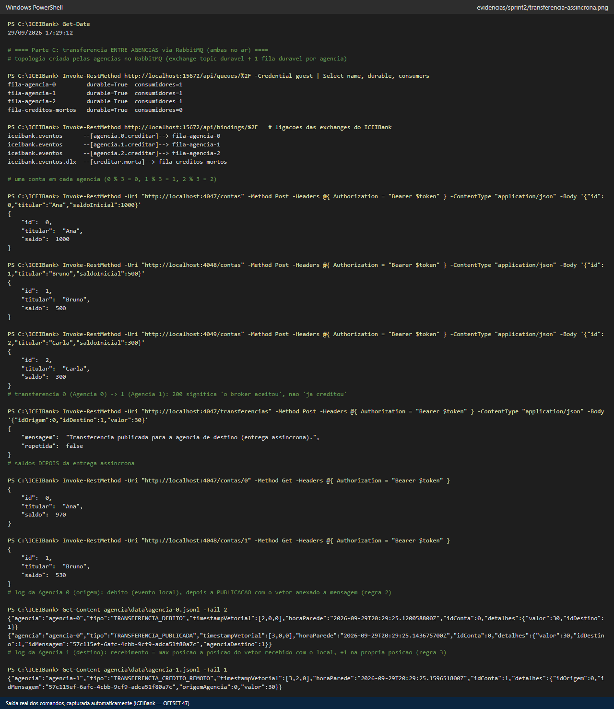
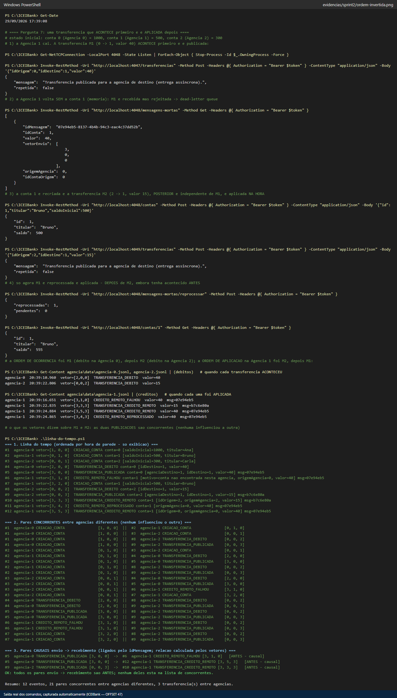
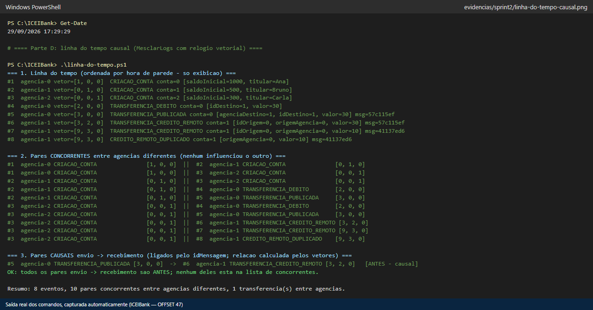

# Comunicação indireta: Mensageria, Pub/Sub e Relógio Vetorial

## Atividade de recapitulação do sistema desenvolvido — Fluxo de Execução

**Aluno:** Gustavo Pessoa Firmino Duarte · **Disciplina:** Laboratório de Desenvolvimento de Aplicações Móveis e Distribuídas · **OFFSET pessoal:** 47

> **Como ler este documento.** As perguntas **1 a 3** descrevem o sistema **como ele estava ao final do Sprint 1** (código congelado na release [`v1.0-sprint1`](https://github.com/GustavoFirmino/ICEIBank/releases/tag/v1.0-sprint1)). As perguntas **4 a 10** pedem para *projetar* a evolução — e, como esta atividade foi respondida junto com a implementação do Sprint 2, cada projeto vem acompanhado do que **foi construído** e de **execuções reais** que o demonstram (marcadas como *execução real*, com o arquivo em [`evidencias/sprint2/`](evidencias/sprint2)). O que é só proposta (não implementado) está sempre identificado como tal.
>
> Verificado contra um RabbitMQ 4.3.6 real, 3 agências reais e **110 testes automatizados** passando. Nenhum número abaixo foi inventado: os vetores, saldos e mensagens são os das execuções.

---

## 1. Arquitetura atual e divisão em agências

**Participantes (Sprint 1).** Não há banco de dados: cada agência guarda suas contas **em memória**.



| Componente (por agência) | Responsabilidade |
|---|---|
| `auth` (`JwtAuthFilter`, `InternalKeyAuthFilter`, `AuthController`) | login → JWT (5 min); protege as rotas; a rota interna entre agências usa uma chave de serviço, não JWT |
| `conta` (`ContasController`, `ContaService`, `ContaRepository`) | criar conta, saldo, depósito, saque, histórico — só das contas **desta** agência |
| `transferencia` (`TransferenciaService`, `IdempotencyStore`, `RemoteBranchClient`) | transferência local e entre agências |
| `clock` (`LamportClockService`) | relógio lógico de Lamport (um contador por agência) |
| `eventlog` (`EventLogService`) | grava cada evento em memória e em `data/agencia-N.jsonl` |

**Como uma conta é associada a uma agência.** Por **partição** (não replicação): `AgenciaProperties.agenciaResponsavel(idConta) = idConta % 3`. O `id` é sempre escolhido pelo **cliente** (nunca autogerado — dois servidores autogerando produziriam ids repetidos e quebrariam a partição). Uma agência recusa (HTTP 400, `ParticaoInvalidaException`) criar/operar uma conta que não é dela.

**O que é local e o que depende de outra agência:**

| Operação | Onde acontece |
|---|---|
| criar conta, consultar saldo, depositar, sacar, histórico | **local** (só a agência dona da conta) |
| transferência em que origem **e** destino são da mesma agência | **local** (dois eventos na mesma JVM) |
| transferência **entre agências** | débito **local** na origem + crédito **na outra agência** ← única operação que atravessa a fronteira |

**Fronteiras de comunicação** (o que a próxima implementação vai mexer): (1) navegador ⇄ agência (HTTP + JWT, **continua igual**); (2) **agência ⇄ agência** (REST direto no Sprint 1) ← **é esta que passa a ser mensageria**.

---

## 2. Comunicação atual entre as agências

**Mecanismo (Sprint 1).** Chamada **REST síncrona**: a agência de origem usa um `RestClient` (`RemoteBranchClientHttp`) para fazer

```
POST http://localhost:{4047 + idAgenciaDestino}/contas/{idConta}/creditar-remoto
X-Internal-Key: <chave compartilhada>
{ "valor": 30, "timestampLamport": 4, "origemAgencia": 0 }
```



**Respostas esperadas:** `200 {mensagem, saldoAtual}` (crédito aplicado); `404` (conta inexistente na destino); `401` (chave interna errada).

**E quando o destinatário não responde?** Testei de verdade no Sprint 1 (registrado em `RESPOSTAS.md`, Parte D): derrubei a Agência 1 e transferi 15 da conta 0 → resposta `502 "Falha ao contatar agência de destino. Débito já aplicado — inconsistência conhecida"`; o saldo da origem ficou em **35 (100 − 20 − 15)** e o log tem `TRANSFERENCIA_DEBITO` seguido de `TRANSFERENCIA_FALHOU`. **O débito não é revertido.** Cenários:

| Situação | O que acontece no Sprint 1 |
|---|---|
| destino **fora do ar** | `ConnectException` → `ComunicacaoAgenciaException` → 502; débito fica aplicado; a mensagem **não fica guardada em lugar nenhum** — se ninguém refizer à mão, o dinheiro sumiu |
| destino **demora** | `readTimeout` de 3 s → cai no mesmo caminho do 502. **Mas o crédito pode ter sido aplicado** depois que a origem desistiu: a origem diz "falhou" e o destino creditou (dinheiro criado). Uma nova tentativa do cliente sem `idOperacao` debitaria **de novo** |
| destino **não recebe** a mensagem | nada foi enfileirado nem reenviado: sem retry, sem buffer, sem confirmação de entrega |

**Motivos para introduzir comunicação indireta:** *acoplamento temporal* (os dois precisam estar no ar ao mesmo tempo); *acoplamento de disponibilidade* (a falha do destino vira falha da origem); a thread HTTP da origem fica **bloqueada** esperando; *ambiguidade no timeout*; cada agência precisa conhecer a URL de todas as outras; e nenhum mecanismo de retentativa. Um *broker* resolve os três primeiros e dá onde guardar a mensagem.

---

## 3. Operações distribuídas e seus efeitos — a transferência entre agências

Operação escolhida: **transferência da conta 0 (Agência 0) para a conta 1 (Agência 1)**.

**Passo a passo (Sprint 1):**

| # | Componente | O que faz | Dado alterado |
|---|---|---|---|
| 1 | Frontend → Agência 0 | `POST /transferencias {idOrigem:0, idDestino:1, valor:30, idOperacao}` com JWT | — |
| 2 | `JwtAuthFilter` | valida o token (401 se ausente/expirado) | — |
| 3 | `IdempotencyStore` | se o `idOperacao` já foi visto, devolve a resposta guardada | cache de idempotência |
| 4 | `TransferenciaService` | `conta0.sacar(30)` → **débito local** | **saldo da conta 0** (memória da Ag. 0) |
| 5 | `EventLogService` | evento `TRANSFERENCIA_DEBITO` (relógio +1) | log da Ag. 0 (memória + `.jsonl`) |
| 6 | `agenciaResponsavel(1) = 1 ≠ 0` | é transferência entre agências → `aoEnviar()` (relógio +1) | relógio da Ag. 0 |
| 7 | `RemoteBranchClientHttp` | `POST creditar-remoto` na Ag. 1 e **espera** | — |
| 8 | Agência 1 | `aoReceber(ts)` → `conta1.depositar(30)` → evento `TRANSFERENCIA_CREDITO_REMOTO` | **saldo da conta 1**, relógio e log da Ag. 1 |
| 9 | Agência 0 | recebe o 200 e responde ao cliente | — |

**Quando é considerada concluída?** No Sprint 1, só quando o `200` da agência de destino volta (passo 9) — mas a operação **não é atômica**: o débito (passo 4) já estava aplicado antes do crédito (passo 8); se algo falhar entre eles, fica pela metade (a "limitação conhecida", resolvida só no Sprint 4 com 2PC/Saga).

**Eventos distribuídos que precisarão virar mensagens:** o **envio** do crédito (passo 7) e o seu **recebimento** (passo 8) — mais a **falha** (o que fazer quando o passo 8 não pode ser aplicado).

---

## 4. Eventos que precisam ser comunicados

| Evento | Dados | Produz | Consome | Status |
|---|---|---|---|---|
| **`CreditoRemoto`** (transferência publicada) | `idMensagem`, `idConta` (destino), `valor`, `vetorEnvio`, `origemAgencia`, `idContaOrigem` | `TransferenciaService` da agência **de origem** | `CreditoRemotoConsumer` da agência **de destino** | ✅ **implementado** |
| **`CreditoRemotoRejeitado`** (não aplicável, ex.: conta inexistente) | a própria mensagem + motivo (cabeçalho `x-death`) | agência de destino (rejeita) → broker (dead-letter) | fila `fila-creditos-mortos` / operador (reprocessa) | ✅ **implementado** (funcionalidade adicional) |
| **`TransferenciaConfirmada`** (crédito aplicado) | `idMensagem`, `idOperacao`, vetor do recebimento | agência de destino, depois do crédito | agência de origem (fecha o ciclo, pode notificar o cliente) | 💡 **proposta** — não implementada |
| **Auditoria / saldo baixo** | qualquer evento do log | qualquer agência (routing key `agencia.<id>.<evento>`) | um consumidor de auditoria assinando `agencia.*.#` (curinga do *topic*) | 💡 **proposta** — não implementada |

Isso já define os **tópicos** (routing keys), as **mensagens** e os **participantes** do modelo Pub/Sub da pergunta 5.

---

## 5. Mensageria e comunicação indireta — a transferência com RabbitMQ

**Projeto e implementação (Sprint 2).** A agência de origem deixa de *chamar* a de destino: ela **publica** um evento e segue.



- **Produtor:** `TransferenciaService` (via `RabbitPublicadorCreditos`) — só retorna depois do *publisher confirm* do broker.
- **Canal/tópico:** exchange `iceibank.eventos` (*topic*, durável); routing key `agencia.<destino>.creditar`. Quem publica **nunca** manda direto para uma fila.
- **Consumidores:** `CreditoRemotoConsumer` de cada agência, na sua fila durável `fila-agencia-N`.
- **Conteúdo** (JSON, *execução real* — capturado da dead-letter queue do experimento de resiliência):

```json
{"idMensagem":"d8834cd3-4bff-4c13-a621-d0d3c89cf1d4","idConta":1,"valor":200,
 "vetorEnvio":[5,0,0],"origemAgencia":0,"idContaOrigem":0}
```

```mermaid
sequenceDiagram
    participant C as Cliente
    participant O as Agência 0
    participant B as RabbitMQ
    participant D as Agência 1
    C->>O: POST /transferencias {0→1, 30}
    O->>O: debita conta 0 [2,0,0]
    O->>B: publica agencia.1.creditar  (vetor [3,0,0] anexado)
    B-->>O: publisher confirm (mensagem gravada em disco)
    O-->>C: 200 "publicada (entrega assíncrona)"
    Note over O,D: a Agência 1 pode estar fora do ar agora
    B->>D: entrega quando ela estiver disponível
    D->>D: aoReceber → [3,2,0]; credita conta 1
    D-->>B: ack (mensagem removida da fila)
```

**Mudança de significado do "200":** no Sprint 1, 200 = "o crédito **já foi aplicado** lá"; agora, 200 = "o **broker aceitou** a mensagem". O crédito acontece depois, em momento que quem chamou não controla.

> 
> *Execução real:* topologia criada, transferência 0→1 (saldos 1000→970 e 500→530) e o log das duas agências com os vetores (`[2,0,0]` débito, `[3,0,0]` publicação, `[3,2,0]` recebimento). Painel do RabbitMQ: [filas](evidencias/sprint2/rabbitmq-manager-filas.png) e [exchange](evidencias/sprint2/rabbitmq-manager-exchange.png).

---

## 6. Entrega, duplicidade e processamento de mensagens

O RabbitMQ garante entrega **"pelo menos uma vez"**: uma mensagem pode chegar mais de uma vez (ex.: o consumidor aplica o crédito e cai **antes** de confirmar o *ack* → o broker reentrega). Sem cuidado, isso **cria dinheiro**.

**Cenário 1 — duplicidade.** Se o consumidor simplesmente somasse o valor a cada entrega, uma segunda entrega da mesma mensagem creditaria de novo. *Execução real* ([`entrega-duplicada.png`](evidencias/sprint2/entrega-duplicada.png)): publiquei **a mesma mensagem duas vezes** direto no RabbitMQ; o saldo da conta 1 foi de **530 → 540 (+10, uma vez só)**, e o log da Agência 1 tem `TRANSFERENCIA_CREDITO_REMOTO` seguido de `CREDITO_REMOTO_DUPLICADO` (mesmo `idMensagem`, mesmo vetor `[9,3,0]` — ignorar uma duplicata **não** conta como evento causal novo). A chave da defesa é o **`idMensagem`** (UUID gerado por quem publica); o consumidor guarda os já aplicados e consulta/atualiza isso de forma **atômica** (método `synchronized`).

**Cenário 2 — falha e reprocessamento.** A agência de destino **reiniciou** e perdeu as contas em memória; chega um crédito para uma conta que não existe. Se o consumidor desse `ack` de qualquer jeito, o dinheiro sumiria em silêncio (débito na origem, crédito em lugar nenhum); se devolvesse a mensagem para a fila, ela seria reentregue **em loop** para sempre. Solução: **rejeitar sem reentrega** (`AmqpRejectAndDontRequeueException`, e `default-requeue-rejected: false`), e o broker a encaminha para a **dead-letter queue**, retida com todos os dados. *Execução real* ([`resiliencia-fila.png`](evidencias/sprint2/resiliencia-fila.png), [`funcionalidade-adicional.png`](evidencias/sprint2/funcionalidade-adicional.png)): mensagem retida com a agência fora do ar → agência volta sem a conta → `CREDITO_REMOTO_FALHOU` → dead-letter (`x-death: rejected`, fila original `fila-agencia-1`) → conta recriada → `POST /mensagens-mortas/reprocessar` → saldo **500 → 700** e fila vazia.

**Cenário 3 — fora de ordem:** ver a pergunta 7 (com experimento real).

**Que informações são necessárias para processar uma mensagem com segurança:**

| Informação | Para quê | No projeto |
|---|---|---|
| identificador único | deduplicar (idempotência) | `idMensagem` |
| origem, conta de destino, valor | aplicar e auditar | `origemAgencia`, `idConta`, `valor`, `idContaOrigem` |
| relógio do remetente | ordenar causalmente / detectar concorrência | `vetorEnvio` |
| política de falha | não perder nem reentregar em loop | *reject sem requeue* + dead-letter |
| durabilidade | sobreviver a queda do broker/consumidor | fila `durable` + mensagem `PERSISTENT` + *publisher confirm* |
| registro de "já aplicada" **persistido** junto com o crédito | idempotência que sobrevive a reinício | ⚠️ hoje em **memória** (limitação — ver abaixo) |

**Limitações honestas:** o conjunto de `idMensagem` aplicados e as contas estão em memória; com um banco real, o "já apliquei" precisaria ser gravado **na mesma transação** do crédito (padrão *inbox*). E débito local + publicação **não são atômicos** (uma queda entre os dois perde a mensagem; o padrão *outbox* resolveria) — assunto do Sprint 4.

---

## 7. Eventos concorrentes e ordenação causal

**Cenário (execução real).** Duas transferências **independentes** para a mesma conta 1, na Agência 1:

- **M1**: Agência 0 → conta 1, valor 40. A Agência 1 está fora do ar; ao voltar, **não tem mais a conta** → M1 é rejeitada e vai para a dead-letter.
- A conta 1 é recriada. **M2**: Agência 2 → conta 1, valor 15 — **posterior** a M1 e independente dela → aplicada na hora.
- Só então M1 é reprocessada e aplicada.

| | Ordem em que **aconteceram** (débitos) | Ordem em que foram **aplicadas** na Agência 1 |
|---|---|---|
| 1º | **M1** — Ag. 0, vetor `[2,0,0]` | **M2** — vetor `[3,3,3]` |
| 2º | **M2** — Ag. 2, vetor `[0,0,2]` | **M1** — vetor `[3,5,3]` |

> 
> *Execução real:* a **ordem de ocorrência** (M1 depois M2) é o **inverso** da **ordem de recebimento/aplicação** (M2 depois M1).

**Consequências para a interpretação dos eventos do banco:**

1. **Extrato/histórico enganoso.** Lendo só o log da Agência 1 na ordem de aplicação, a conta 1 teria ido 500 → 515 → 555; na ordem em que as transferências aconteceram seria 500 → 540 → 555. Um saldo intermediário que nunca existiu na ordem real.
2. **Operações não comutativas.** Créditos somam em qualquer ordem, mas um **saque** que depende do saldo dá resultado diferente conforme a ordem (saque antes ou depois do crédito → "saldo insuficiente" ou não).
3. **Causa e efeito ambíguos.** Olhando a ordem de chegada, dá para concluir (errado) que M2 "veio antes" de M1 ou que uma influenciou a outra.
4. **Nem a hora de parede resolve.** Máquinas diferentes têm relógios diferentes; e, como o próprio experimento mostrou, até a hora de *gravação* do log pode enganar: numa versão anterior deste projeto o evento de publicação era carimbado depois do *publisher confirm* e a linha do tempo por hora mostrava o **crédito antes da publicação** que o causou (corrigido no commit `6d12a1a` — o evento agora carrega a hora em que o envio *aconteceu*; o vetor sempre esteve certo).

**Três coisas que precisam ser distinguidas:** **ordem local** (dentro de uma agência, os eventos são totalmente ordenados pelo seu próprio contador), **ordem de recebimento** (a ordem em que a Agência 1 processou — depende da rede, de retentativas e da dead-letter) e **relação causal** (quem *pode* ter influenciado quem — só o relógio vetorial responde). No experimento, as publicações de M1 (`[3,0,0]`) e M2 (`[0,0,3]`) são **concorrentes**: nenhuma domina a outra.

---

## 8. Relógio vetorial na aplicação

**Quem participa:** as **3 agências** — o vetor tem 3 posições, `vetor[i]` = quantos eventos da agência *i* este evento "conhece". O **broker não participa** (não incrementa nada; só transporta o vetor dentro da mensagem) e o **frontend também não**.

**Quando é atualizado** (`RelogioVetorialService`, `synchronized`):

| Momento | Regra | Exemplo no código |
|---|---|---|
| **evento local** (criar conta, depósito, saque, débito, crédito local, estorno, reprocessamento) | +1 na **própria** posição | `relogio.eventoLocal()` |
| **ao enviar** (publicar o crédito) | +1 na própria posição e **anexa o vetor inteiro** à mensagem | `relogio.aoEnviar()` → campo `vetorEnvio` |
| **ao receber** (consumidor) | `vetor[i] = max(vetor[i], recebido[i])` para toda posição *i*, **depois** +1 na própria | `relogio.aoReceber(vetorEnvio)` — vale até quando o crédito é rejeitado: receber é um evento |

**Como comparar dois eventos** (`Vetores.comparar`): `V1 ≤ V2` em **toda** posição (e diferentes) ⇒ `V1` aconteceu **antes**; nenhum domina o outro ⇒ **concorrentes**.

**Dois eventos concorrentes** (*execução real*): a criação da conta 0 na Agência 0, `[1,0,0]`, e a criação da conta 1 na Agência 1, `[0,1,0]` — a posição 0 favorece o primeiro (1 > 0) e a posição 1 favorece o segundo (1 > 0). Ninguém influenciou ninguém. (No Sprint 1, com Lamport, os dois tinham **timestamp 1** e não havia como provar isso.)

**Dois eventos causalmente relacionados** (*execução real*): o **débito** na Agência 0, `[2,0,0]`, a **publicação**, `[3,0,0]`, e o **crédito** na Agência 1, `[3,2,0]`. Como o `[3,2,0]` nasce: a Agência 1 estava em `[0,1,0]` (só criou a conta) e recebeu `[3,0,0]` → `max` posição a posição = `[3,1,0]` → +1 na sua posição = **`[3,2,0]`**. Como `[2,0,0] ≤ [3,0,0] ≤ [3,2,0]`, o débito aconteceu antes da publicação, que aconteceu antes do crédito.

*Nota:* os relógios são em memória — reiniciar uma agência zera o seu contador (as demais agências "lembram" parte do seu valor por meio dos vetores que recebem, o que ajuda a restaurá-lo). Persistir o vetor é trabalho para quando houver banco.

---

## 9. Consistência e observabilidade dos eventos

**O que é registrado** (cada linha do `data/agencia-N.jsonl`, `Evento`):

```json
{"agencia":"agencia-1","tipo":"TRANSFERENCIA_CREDITO_REMOTO","timestampVetorial":[3,2,0],
 "horaParede":"…Z","idConta":1,
 "detalhes":{"idMensagem":"57c115ef-…","origemAgencia":0,"valor":30,"idOrigem":0}}
```

| Dado | Serve para |
|---|---|
| `timestampVetorial` | decidir **antes / depois / concorrente** (`Vetores.comparar`) |
| `idMensagem` (nos eventos de envio **e** de recebimento) | **ligar** o envio ao recebimento da mesma mensagem, entre agências |
| `agencia`, `tipo`, `idConta`, `detalhes` (`origemAgencia`, `valor`, `motivo`) | saber **quem** fez **o quê** com **qual conta** |
| `horaParede` | **só exibição** (não decide nada — ver pergunta 7) |
| metadados do broker: `messageId`, `x-death` (motivo, fila original, contagem), contadores por fila | rastrear rejeições e mensagens retidas |

**Como responder cada pergunta com esses dados** — é o que o `MesclarLogs` (`.\linha-do-tempo.ps1`) faz, em 3 seções:

1. *"Uma mensagem foi produzida antes ou depois de outra?"* → comparar os vetores dos eventos `TRANSFERENCIA_PUBLICADA`.
2. *"Dois eventos são concorrentes?"* → **seção 2** (todos os pares de agências diferentes cujo vetor não é comparável).
3. *"Uma agência recebeu informação causada por eventos de outra?"* → **seção 3**: para cada `idMensagem`, o par envio → recebimento com a relação **calculada** pelos vetores; deve ser sempre `ANTES` (qualquer outra coisa denunciaria um bug no relógio). Além disso, a posição *j* do vetor de um evento na agência *i* diz quantos eventos da agência *j* essa agência já "conhece".

> 
> *Execução real:* 8 eventos, 10 pares concorrentes entre agências diferentes, e o par causal envio → recebimento `[3,0,0] → [3,2,0]` verificado como `ANTES` — **e ausente** da lista de concorrentes.

E o experimento da pergunta 7 mostra a ferramenta apontando o par **concorrente** de verdade (as publicações de M1 e M2) e os pares **causais** de cada mensagem:

> 

---

## 10. Proposta de evolução (e o que foi construído)

**Operação modificada:** a **transferência entre agências** (`POST /transferencias` quando origem e destino estão em agências diferentes).

**Componentes envolvidos:** `TransferenciaService` (produtor) · `RabbitPublicadorCreditos` (publica + confirm) · **RabbitMQ** (exchange `iceibank.eventos`, 3 filas duráveis, dead-letter) · `CreditoRemotoConsumer` + `TransferenciaService.processarCreditoRemoto` (consumidor idempotente) · `RelogioVetorialService` (substitui o de Lamport) · `EventLogService` · `MesclarLogs`.

**Mensagens trocadas:** o `CreditoRemoto` (pergunta 5), na routing key `agencia.<destino>.creditar`; a mensagem rejeitada, na dead-letter.

**Metadados acrescentados:** `idMensagem` (idempotência e ligação envio↔recebimento) e `vetorEnvio` (causalidade); nos eventos do log, `timestampVetorial` no lugar de `timestampLamport`. Novos tipos de evento: `TRANSFERENCIA_PUBLICADA`, `CREDITO_REMOTO_FALHOU`, `CREDITO_REMOTO_DUPLICADO`, `CREDITO_REMOTO_REPROCESSADO`.

**Como demonstrar que funciona** (e o que foi observado):

| Propriedade | Demonstração | Resultado |
|---|---|---|
| entrega assíncrona correta | transferência 0→1 com ambas no ar | 1000→970 e 500→530 · [`transferencia-assincrona.png`](evidencias/sprint2/transferencia-assincrona.png) |
| destino fora do ar não perde a mensagem | derrubar a Agência 1 e transferir para ela | resposta 200; mensagem **retida** (1 pronta, 0 consumidores) · [`resiliencia-fila.png`](evidencias/sprint2/resiliencia-fila.png) |
| entrega duplicada não duplica crédito | mesma mensagem publicada 2× | +10, uma vez só · [`entrega-duplicada.png`](evidencias/sprint2/entrega-duplicada.png) |
| falha não some em silêncio | conta inexistente no destino | dead-letter, dados intactos, reprocessável (500→700) · [`funcionalidade-adicional.png`](evidencias/sprint2/funcionalidade-adicional.png) |
| broker fora do ar | parar o RabbitMQ e transferir | **503** e débito **estornado** (770→770); o mesmo `idOperacao` funciona depois · [`broker-fora-do-ar.png`](evidencias/sprint2/broker-fora-do-ar.png) |
| causalidade correta | `MesclarLogs` | todos os pares envio→recebimento são `ANTES`; concorrentes identificados · [`linha-do-tempo-causal.png`](evidencias/sprint2/linha-do-tempo-causal.png) |
| nada do Sprint 1 quebrou | JWT + frontend | [`regressao-jwt.png`](evidencias/sprint2/regressao-jwt.png), [`regressao-frontend-transferencia.png`](evidencias/sprint2/regressao-frontend-transferencia.png) |
| lógica correta em geral | testes automatizados | **110 testes** (relógio, comparação de vetores, mensageria, dead-letter, causalidade) |

**O que a mensageria melhora, e o que continua em aberto** (deliberadamente — é o Sprint 4): *melhora* — o destino fora do ar deixou de ser erro, o debito é estornado se o broker recusar, e nada é reentregue em loop nem duplicado. *Continua em aberto* — "a mensagem não se perde" **não** significa "o sistema está correto": enquanto o crédito não é aplicado (ex.: mensagem na dead-letter), o dinheiro está debitado e não creditado (consistência só **eventual**, e só se alguém reprocessar); débito local + publicação não são atômicos; o estado é em memória. A solução correta para a atomicidade entre agências é o **2PC ou a Saga** (Sprint 4), possivelmente com *outbox/inbox*.

---

### Mapa rápido: onde ver cada coisa

| Assunto | Código | Evidência |
|---|---|---|
| relógio vetorial | [`RelogioVetorialService`](agencia/src/main/java/br/pucminas/labdamd/iceibank/agencia/clock/RelogioVetorialService.java), [`Vetores`](agencia/src/main/java/br/pucminas/labdamd/iceibank/agencia/clock/Vetores.java) | [`linha-do-tempo-causal.png`](evidencias/sprint2/linha-do-tempo-causal.png) |
| publish/subscribe | [`MensageriaConfig`](agencia/src/main/java/br/pucminas/labdamd/iceibank/agencia/mensageria/MensageriaConfig.java), [`RabbitPublicadorCreditos`](agencia/src/main/java/br/pucminas/labdamd/iceibank/agencia/mensageria/RabbitPublicadorCreditos.java), [`CreditoRemotoConsumer`](agencia/src/main/java/br/pucminas/labdamd/iceibank/agencia/mensageria/CreditoRemotoConsumer.java) | [`transferencia-assincrona.png`](evidencias/sprint2/transferencia-assincrona.png) |
| idempotência, dead-letter | [`TransferenciaService`](agencia/src/main/java/br/pucminas/labdamd/iceibank/agencia/transferencia/TransferenciaService.java), [`MensagensMortasService`](agencia/src/main/java/br/pucminas/labdamd/iceibank/agencia/mensageria/MensagensMortasService.java) | [`entrega-duplicada.png`](evidencias/sprint2/entrega-duplicada.png), [`funcionalidade-adicional.png`](evidencias/sprint2/funcionalidade-adicional.png) |
| linha do tempo causal | [`MesclarLogs`](agencia/src/main/java/br/pucminas/labdamd/iceibank/agencia/ferramentas/MesclarLogs.java) | [`ordem-invertida.png`](evidencias/sprint2/ordem-invertida.png) |
| respostas do roteiro do Sprint 2 | [`RESPOSTAS.md`](RESPOSTAS.md) | — |

*Declaração de uso de IA:* usei o Claude (Anthropic) como apoio para rascunhar, implementar e revisar código e texto; todo o código foi executado e verificado por mim nesta máquina (testes automatizados e execuções reais contra um RabbitMQ real), e consigo explicar e defender qualquer trecho.
